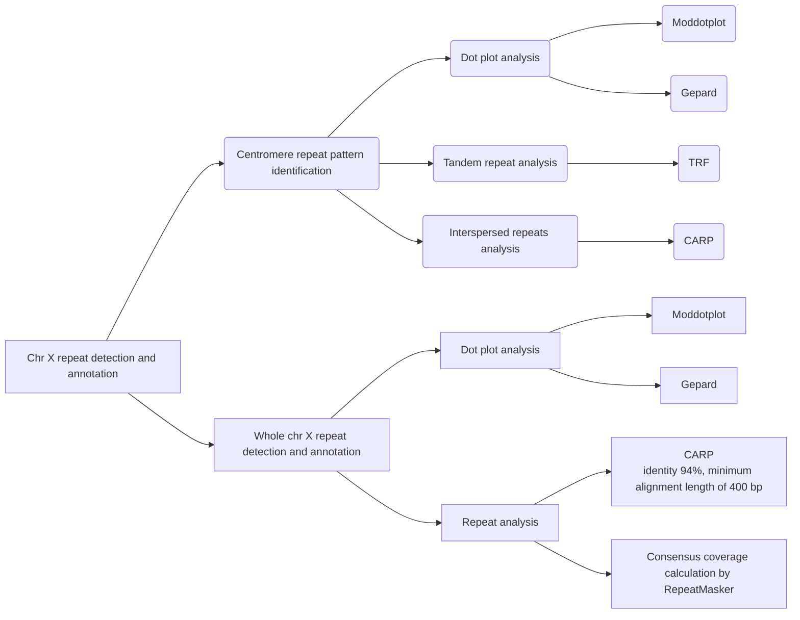

# Wagyu chromosome X repeats detection and annotation

This script aims to identify and annotate the repeats in T2T Wagyu chromosome X

## Analysis overview
Here are the key methods used to detect and annotate repeats in the chromosome X and its centromere region:



### Dotplot analysis
Using ModDotPlot for dotplot analysis to get a self-alignment plot for chromosome X and the centromere region.

```bash
# ModDotplot installation, please refer to https://github.com/marbl/ModDotPlot
# Running ModDotplot
$ conda activate py3
$ source venv/bin/activate # Activate the virtual environment
# Dot plot for chrX
$ moddotplot interactive -f sequences/X.fa
# Dot plot for chrX centromere
$ moddotplot interactive -f sequences/X_38Mb_to_50Mb.fa
```
### Tandem repeat finder (TRF)
Looking for two or two more adjacent approximate copies of a pattern.

1. Run TRF with 2000bp as the maxperiod. Refer to the script `trf_chrX_command.sh`.
   You can sort results by alignment score to find the good matches:
   ```bash
   $ awk -v OFS="\t" '{print $1, $2, $3, $4, $5, $6, $7, $8}' trf_chrX_2000.txt | sort -t $'\t' -k8,8nr | less
   ```
2. Convert the TRF result to a bed file. Refer to the script `convert_to_bed.sh`
   If you are interested in a region within this chromosome, keep `chromosome="X:38000000-50000000"` in `convert_to_bed.sh`, if not, remove it.
   
3. View by JBrowser2 to look at the pattern
   - Download and install JBrowse 2 from: [https://jbrowse.org/jb2/download/](https://jbrowse.org/jb2/download/).
   - Launch a new session with `Open Sequence File(s)`.
   - Set the genome name to `X`, choose `FastaAdapter` as the type, select your local genome file, then click `Submit`.
   - Choose `Linear Genome View`, click `Launch View`, then `Open`.
   - On the main page, go to the `File` tab → `Open track`.
   - In the `Add a Track` window, click `Choose File` under `Enter Track Data`, and select your TRF file.
   - Click `Next`, then `Add` to view the TRF file.


### Running CARP on HPC

1. First, run the script `krishna+igor+seqer.sh`, followed by `filtering.sh`.  
   These are Slurm scripts designed for HPC. Adjust computational resources as needed for your system.

2. For the latest CARP documentation, visit:  
   [https://github.com/Luan-Zhong/carp-documentation](https://github.com/Luan-Zhong/carp-documentation)

3. To modify sequence similarity and minimum filtering length, update the parameters `-filtid` and `-filtlen` in the following command:

   ```bash
   singularity exec $container matrix -threads=$THREADS \
     -krishnaflags="-tmp=./ -threads=$THREADS -log -filtid=0.94 -filtlen=400 -target=$K_INPUT" \
     $K_INPUT

### Result visualization
The CARP consensus results are visualized by R, which refers to the script `CARP_visualization.R`.
